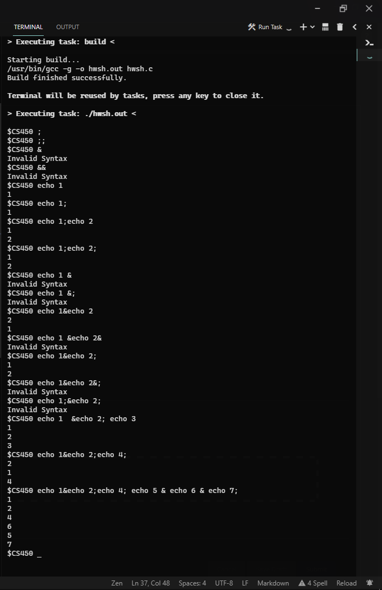

# CS 450 - Operating Systems
## Programming Assignment 1

### How to compile

Run the following command in a Linux system with build-essential installed.
I used Debian.
> gcc -o hwsh.out hwsh.c


### How to run

Run the following command after the binary is generated.
Give execution privileges if necessary.
> ./hwsh.out

### Test Cases
The following are the test cases used to test this implementation of the `&` and `;` operators.

``` sh
;
;;
&                       X
&&                      X
echo 1
echo 1;
echo 1;echo 2
echo 1;echo 2;
echo 1 &                X
echo 1&echo 2
echo 1 &echo 2&         X
echo 1&echo 2;
echo 1;&echo 2;         X
echo 1  &echo 2; echo 3
echo 1&echo 2;echo 4;
echo 1&echo 2;echo 4; echo 5 & echo 6 & echo 7;
```
<sup>Lines marked with an `X` should fail</sup>

I did not use the equivalence partitioning method, however, the method that I used was to start off with a normal command and then build onto it more operators and commands that would cover the criteria given by the instructions.



### Major changes made

Most of the skeleton code for the pipe and redirection operators were removed, as it made it a bit difficult with how cluttered it was.

All the code is auto formatted using my IDE.

Main while loop of the shell is now infinite 